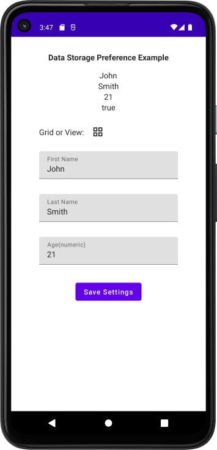

# DataStore Preferences
- This is a learning project
 
## Just an app for me to learn DataStore Preferences concepts

- Note: We are not using a viewmodel yet
- Display Screen
  - Data is initialized in viewModel from saved preferences
  - Displays 3 Text Fields
  - Layout Choice Icon(toggles)
  - Save Settings Button
- on Save Settings Button Click
  - we update the 3 textfield and layout choice to preferences

  

ref: demo-datastore-preferences-app-android-kotlin-compose